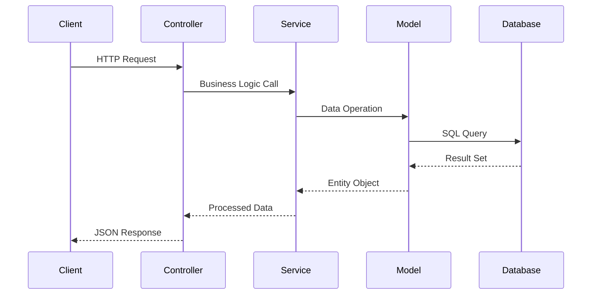

# Diagrama de Classes Simplificado - Girls Chat API

## Estrutura Principal das Classes

```mermaid
graph TB
    subgraph "📊 MODELS (Entidades)"
        User[👤 User<br/>- id, email, password, name<br/>- lastLogin, createdAt, updatedAt]
        Chat[💬 Chat<br/>- id, id_host, participant<br/>- last_message, last_message_at]
        Message[📝 Message<br/>- id, id_chat, text, seen<br/>- sentBy, sentTo, createdAt]
        Notification[🔔 Notification<br/>- id, id_chat, id_user<br/>- text, seen, createdAt]
    end

    subgraph "🎮 CONTROLLERS (Apresentação)"
        UC[UsersController<br/>- login(), signUp()<br/>- index(), update()]
        CC[ChatsController<br/>- index(), show()<br/>- create()]
        MC[MessagesController<br/>- index(), create()<br/>- updateSeenStatus()]
    end

    subgraph "⚙️ SERVICES (Negócios)"
        US[UserService<br/>- getUserByEmailAndPassword()<br/>- createUser(), updateUser()<br/>- getAllUsersExcept()]
        CS[ChatsService<br/>- getUserChats(), showChat()<br/>- createChat(), updateLastMessage()]
        MS[MessagesService<br/>- getMessagesByChatID()<br/>- createMessage()<br/>- updateMessageSeenStatus()]
    end

    subgraph "🔧 UTILITIES"
        VU[ValidationUtils<br/>- isValidEmail()]
        IO[IoSocketServer<br/>- io: SocketIoServer<br/>- boot()]
    end

    %% Relacionamentos dos Models
    User ---|1:N| Chat
    Chat ---|1:N| Message
    Chat ---|1:N| Notification
    User ---|1:N| Message
    User ---|1:N| Notification

    %% Dependências Controller -> Service
    UC --> US
    CC --> CS
    MC --> MS

    %% Dependências Service -> Model
    US --> User
    CS --> Chat
    MS --> Message
    MS --> CS

    %% Dependências Utilities
    US --> VU

    style User fill:#e1f5fe
    style Chat fill:#f3e5f5
    style Message fill:#e8f5e8
    style Notification fill:#fff3e0
    style UC fill:#ffebee
    style CC fill:#ffebee
    style MC fill:#ffebee
    style US fill:#f1f8e9
    style CS fill:#f1f8e9
    style MS fill:#f1f8e9
```

## Resumo dos Relacionamentos

| Model | Relacionamentos |
|-------|----------------|
| **User** | • Hospeda vários Chats (1:N)<br/>• Participa de vários Chats (1:N)<br/>• Envia/Recebe Mensagens (1:N)<br/>• Possui Notificações (1:N) |
| **Chat** | • Pertence a 2 Users (N:1)<br/>• Contém Mensagens (1:N)<br/>• Gera Notificações (1:N) |
| **Message** | • Pertence a 1 Chat (N:1)<br/>• Enviada por 1 User (N:1)<br/>• Recebida por 1 User (N:1) |
| **Notification** | • Pertence a 1 Chat (N:1)<br/>• Destinada a 1 User (N:1) |

## Fluxo de Dados

